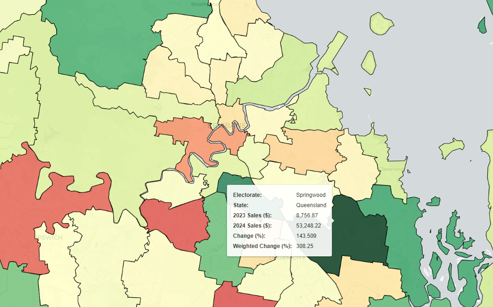

## Australia Sales Heat Map Analysis Tool
### Overview
This repository provides users with detailed and interactive visualizations of sales data across Australia. The tool includes a range of heat map customization features, enabling targeted analysis by selecting various metrics and resolutions. This tool is particularly valuable for understanding sales concentration, with key applications in:
- <b>Marketing</b> 
    - <b>Targetted ad campaigns:</b> Deliver targeted campaigns using Google Ads, which allows you to promote our products in areas of potential growth, or areas with slowing growth, the choice is yours
- <b>Sales</b> 
    - <b>Localised outreach:</b> Use data to identify regions with high consumer interest in your products or services. This data can support outreach to local customers, encouraging them to adopt products already popular within their community.
- <b>Expansion</b> 
    - <b>Strategic Growth:</b> Pinpoint areas where your brand is gaining traction, serving as an indicator for potential expansion of company stores/locations.

### Key Features
- Flexible
    - Users can analyze sales data at Postcode, State Electorate, Federal Electorate, or State levels for more detailed insights.
- State Filtering 
    - Users can choose to only analyse certain states, saving unwanted file and processing overheads
- Interactive Hover Tool
    - Hover over regions to access key information such as region name, sales aggregates, and growth metrics.
- Multi-Year Aggregate and Growth Analysis
    - Users can choose from different colouring schemes, such as aggregate, percentage change or weighted percentage change 
    - A logarithmic colouring system is used for growth data to account for the variety of aggregate sales data (e.g. accounts for high growth of low aggregate data)

### Installation 
To install this repository, clone it and install the required dependencies
```markdown
```bash
# Clone the repository
git clone https://github.com/Benbalth04/MapAlyticsMain.git
cd MapAlyticsMain

# Install Node.js dependencies
npm install

# Install Python dependencies
pip install -r src/python/requirements.txt
```
### Example Output
The below video highlights the easy-to-use and interactive sales map produced by the script:

The below screenshot is of the HTML file produced for a Federal Electorate Resolution of QLD, NSW and Victoria Sales Data:


### Process Architecture
Insert flow chart of process 


