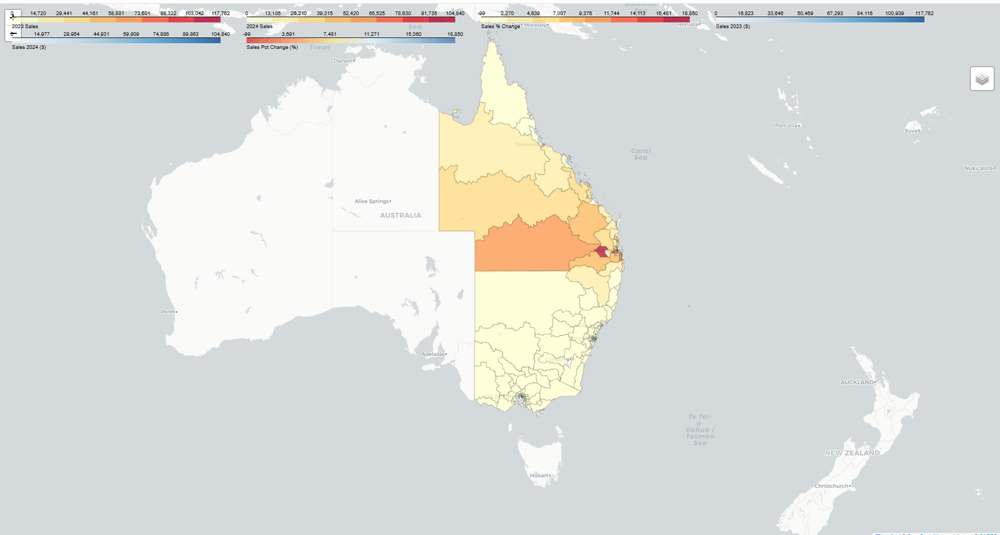

## Sales Heat Map Analysis Tool
### Overview

### Key Features 

### Installation 
To install this repository, clone it and install the required dependencies
```markdown
```bash
# Clone the repository
git clone https://github.com/Benbalth04/MapAlyticsMain.git
cd MapAlyticsMain

# Install Node.js dependencies
npm install

# Install Python dependencies
pip install -r src/python/requirements.txt
```
### Example Output for a 
The below screenshot is of the HTML file produced for a Federal Electorate Resolution of QLD, NSW and Victoria Sales Data 



